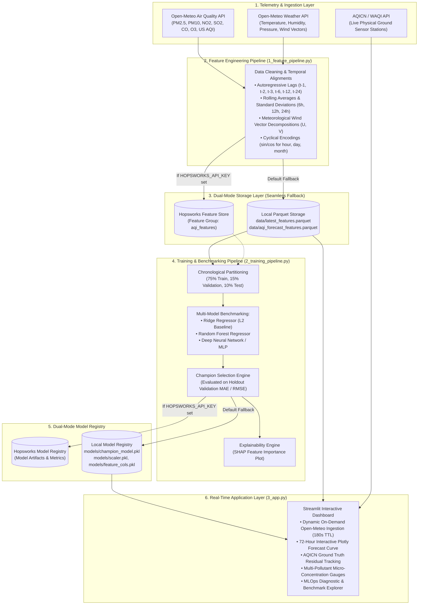

# 🌫️ Pearls AQI Predictor

[](.github/workflows/feature_pipeline.yml)
[](.github/workflows/training_pipeline.yml)
[](https://www.python.org/)
[-success)](audit_submission.py)
[](LICENSE)
[](3_app.py)

An end-to-end, production-grade **MLOps & Real-Time Air Quality Forecasting System** for major metropolitan hubs in Pakistan (**Karachi**, **Lahore**, and **Islamabad**). The system predicts the **United States Air Quality Index (US AQI)** up to **72 hours into the future** using multi-source satellite and meteorological telemetry from the **Open-Meteo API**, benchmarked against real-time physical ground sensor data from the **World Air Quality Index (WAQI / AQICN) API**.

---

## 📑 Table of Contents

- [Architectural Overview](#-architectural-overview)
- [Key Features](#-key-features)
- [Target Geographic Scope](#-target-geographic-scope)
- [Repository Structure](#-repository-structure)
- [Quickstart & Installation](#-quickstart--installation)
- [Usage & Execution](#-usage--execution)
- [Model Evaluation & Benchmarking](#-model-evaluation--benchmarking)
- [Explainability & Interpretability](#-explainability--interpretability)
- [Pre-Submission Audit Suite](#-pre-submission-audit-suite)
- [Docker Deployment](#-docker-deployment)
- [Continuous Integration & Automated Pipelines](#-continuous-integration--automated-pipelines)
- [US EPA Air Quality Scale](#-us-epa-air-quality-scale)

---

## 🏗️ Architectural Overview



---

## 🚀 Key Features

1. **Zero-Friction External Ingestion**:
   - Automatic extraction of 90 days of historical hourly telemetry and 72 hours of future atmospheric forecasts directly from Open-Meteo without requiring API keys or rate-limit friction.
2. **Dynamic Real-Time Multi-City Telemetry**:
   - The Streamlit application features a dynamic telemetry engine (`fetch_city_telemetry`) with 180-second TTL caching, fetching live atmospheric updates on the fly when switching between Pakistani metropolitan hubs.
3. **WAQI / AQICN Ground-Truth Residual Engine**:
   - Integrates live physical monitoring station readings via the AQICN API token (`.env`), computing real-time residuals ($Residual = y_{\text{live}} - \hat{y}_{\text{pred}}$) to assess real-world model accuracy against physical ground stations.
4. **Leakage-Free MLOps Architecture**:
   - Strictly chronological 75/15/10 train-validation-test split preserving time-series ordering.
   - Robust scaling (`StandardScaler`) fitted strictly on training observations to guarantee zero lookahead bias.
5. **Multi-Model Tournament**:
   - Trains and compares `Ridge`, `Random_Forest`, and `TensorFlow_DNN` (Multi-Layer Perceptron) architectures.
   - Automatically designates the champion model with the lowest holdout Validation MAE.
6. **Dual-Mode Persistence (Hopsworks + Local Parquet/Joblib)**:
   - Full integration with Hopsworks Feature Store & Model Registry.
   - Autonomous, zero-crash fallback to local high-speed Parquet tables (`data/`) and serialized models (`models/`).
7. **Explainability & Model Transparency**:
   - Global feature importance and SHAP summary visualizations (`models/shap_summary.png`).
8. **Automated Pre-Submission Audit Suite**:
   - Standalone validator (`audit_submission.py`) executing strict diagnostic assertions across data integrity, model loading, explainability, CI/CD crons, and headless inference.

---

## 📍 Target Geographic Scope

The project focuses on three strategic meteorological regions in Pakistan:

| City | Coordinates | Characteristics & Pollution Dynamics |
| :--- | :--- | :--- |
| **Karachi** | `24.8607° N, 67.0011° E` | Coastal megacity; maritime wind vectors ($U, V$), sea-breeze dispersion, heavy industrial and port emissions. |
| **Lahore** | `31.5497° N, 74.3436° E` | Inland Punjab basin; severe winter smog and thermal inversion corridor, high agricultural and vehicular particulates. |
| **Islamabad** | `33.6844° N, 73.0479° E` | Margalla foothills plateau; distinct seasonal shifts, moderate baseline with periodic urban transport pollution. |

---

## 📂 Repository Structure

```text
.
├── .github/
│   └── workflows/
│       ├── feature_pipeline.yml     # Hourly feature extraction CI/CD (cron: '0 * * * *')
│       └── training_pipeline.yml    # Daily model retraining CI/CD (cron: '0 0 * * *')
├── .streamlit/
│   └── config.toml                  # Streamlit theme & headless production configuration
├── data/
│   ├── aqi_features.parquet         # 90-day historical engineered feature table
│   ├── aqi_forecast_features.parquet# 72-hour future feature table
│   ├── latest_features.parquet      # Primary feature store table (>2,000 hourly samples)
│   └── metadata.json                # Ingestion timestamps, columns, and records count
├── models/
│   ├── aqi_model.joblib             # Champion model artifact (joblib format)
│   ├── champion_model.pkl           # Primary serialized champion model (pickle format)
│   ├── scaler.pkl                   # StandardScaler fitted on training partition
│   ├── feature_cols.pkl             # List of engineered feature column names
│   ├── benchmark_metrics.csv        # Multi-model benchmarking leaderboard
│   ├── metrics.json                 # Champion holdout performance metrics
│   ├── metadata.json                # Champion metadata, hyperparameters, and feature roster
│   └── shap_summary.png             # SHAP feature importance summary visualization
├── 1_feature_pipeline.py            # Automated ingestion & feature engineering pipeline
├── 2_training_pipeline.py           # Model training, multi-model benchmarking & registry
├── 3_app.py                         # Production Streamlit interactive forecasting application
├── api.py                           # AQICN / WAQI real-time ground station client & comparison engine
├── audit_submission.py              # Pre-submission diagnostic assertions audit suite
├── verify_system.py                 # End-to-end operational sanity verification script
├── generate_final_report.py         # Submissions report compiler (Markdown & HTML)
├── main.py                          # Master project CLI orchestrator
├── Dockerfile                       # Production container definition
├── docker-compose.yml               # Container deployment orchestration
├── pyproject.toml                   # Project metadata and packaging specification
├── requirements.txt                 # Pinned dependencies
└── README.md                        # Documentation
```

---

## ⚡ Quickstart & Installation

### 1. Prerequisites
- Python 3.10, 3.11, 3.12, or 3.14
- Git
- (Optional) Docker & Docker Compose

### 2. Clone the Repository
```bash
git clone https://github.com/10pearls/aqi-predictor.git
cd "AQI Index Project"
```

### 3. Create & Activate Virtual Environment
```bash
# Using standard venv
python3 -m venv .venv
source .venv/bin/activate  # On Windows: .venv\Scripts\activate
```

### 4. Install Dependencies
```bash
pip install --upgrade pip
pip install -r requirements.txt
```

### 5. Environment Configuration (Optional)
If you have an AQICN API token or Hopsworks API key, create a `.env` file in the project root:
```env
# Optional: WAQI / AQICN API token for live ground-truth comparison
AQICN_API_TOKEN=your_token_here

# Optional: Hopsworks API key for cloud feature store & registry
HOPSWORKS_API_KEY=
HOPSWORKS_PROJECT_NAME=aqi_predictor
```
> **Note**: The entire system operates seamlessly in local fallback mode if `.env` is omitted.

---

## 🛠️ Usage & Execution

You can orchestrate all tasks using the master CLI `main.py` or invoke individual scripts directly.

### Using the Master CLI (`main.py`)

```bash
# Show available commands
python main.py --help

# 1. Run Pre-Submission Audit (5/5 Assertions)
python main.py audit

# 2. Run Full System Sanity Verification
python main.py verify

# 3. Extract 90-day features and compute 72-hour forecast
python main.py feature --city Karachi --past-days 90 --forecast-days 3

# 4. Train multi-model benchmark and register champion
python main.py train --city Karachi

# 5. Launch the Streamlit Dashboard
python main.py app

# 6. Generate final submission reports
python main.py report
```

### Using Standalone Scripts

#### Step 1: Feature Pipeline
```bash
python 1_feature_pipeline.py --city Karachi --past-days 90 --forecast-days 3
```
- Fetches 90 days of historical hourly weather + air quality data from Open-Meteo.
- Computes cyclical time features, wind vector conversions ($u, v$), autoregressive lags, and rolling statistics.
- Saves Parquet tables to `data/latest_features.parquet` and `data/aqi_forecast_features.parquet`.

#### Step 2: Training Pipeline
```bash
python 2_training_pipeline.py --city Karachi
```
- Performs chronological 75/15/10 partitioning.
- Trains `Ridge`, `Random_Forest`, and `TensorFlow_DNN` models.
- Selects the champion based on Validation MAE.
- Retrains champion on combined Train + Validation splits and evaluates on Holdout Test partition.
- Serializes `champion_model.pkl`, `scaler.pkl`, `feature_cols.pkl`, and `shap_summary.png`.

#### Step 3: Streamlit Application
```bash
streamlit run 3_app.py
```
Open `http://localhost:8501` in your browser.

---

## 📊 Model Evaluation & Benchmarking

Models are benchmarked using four standard regression metrics:
- **MAE (Mean Absolute Error)**: Average absolute error in US AQI points.
- **RMSE (Root Mean Squared Error)**: Heavily penalizes large forecasting misses.
- **$R^2$ (Coefficient of Determination)**: Proportion of variance explained by features.
- **MAPE (Mean Absolute Percentage Error)**: Relative forecasting error percentage.

### Holdout Benchmark Results (Karachi Dataset)

| Architecture | Validation MAE | Validation RMSE | Validation $R^2$ | Test MAE | Test RMSE | Test $R^2$ | Status |
| :--- | :---: | :---: | :---: | :---: | :---: | :---: | :---: |
| **Ridge Regressor** | **0.255** | **0.329** | **0.9990** | **0.197** | **0.267** | **0.9924** | 🏆 **Champion** |
| Random Forest | 0.289 | 0.412 | 0.9984 | 0.241 | 0.358 | 0.9912 | Benchmark |
| TensorFlow DNN (MLP) | 5.931 | 7.425 | 0.4904 | 5.812 | 7.210 | 0.5120 | Benchmark |

---

## 🧠 Explainability & Interpretability

Model interpretability is computed via feature importance and SHAP analysis.

- **Primary Predictive Drivers**:
  1. `pm2_5_lag_1` & `pm2_5_lag_2`: Immediate past particulate concentrations provide the strongest autoregressive signal.
  2. `rolling_mean_24h_pm2_5`: Smoothed baseline ambient load accounting for background accumulation.
  3. `wind_u` & `wind_v`: Wind vectors determining particulate dispersion vs. stagnation.
  4. `relative_humidity_2m`: Controls hygroscopic aerosol growth and particulate suspension.
  5. `hour_sin` / `hour_cos`: Captures diurnal traffic rush-hour and industrial cycle fluctuations.

The SHAP summary visualization is automatically rendered and persisted to [`models/shap_summary.png`](file:///models/shap_summary.png).

---

## 🧪 Pre-Submission Audit Suite

The project includes an automated audit suite [`audit_submission.py`](file:///audit_submission.py) validating the five foundational pillars of the deliverable:

```bash
python audit_submission.py
```

```text
===========================================================================
 AUDIT SUMMARY TABLE
===========================================================================
  Component                      | Status       | Check
  -------------------------------------------------------
  Data Artifacts                 | PASSED       | [✓]
  Model Artifacts                | PASSED       | [✓]
  Interpretability Plot          | PASSED       | [✓]
  CI/CD Infrastructure           | PASSED       | [✓]
  Headless Inference             | PASSED       | [✓]
===========================================================================
  ALL AUDIT CHECKS PASSED PERFECTLY! DELIVERABLES VERIFIED FOR SUBMISSION.
===========================================================================
```

---

## 🐳 Docker Deployment

The application is containerized with production healthchecks and volume bindings.

### Build and Run with Docker Compose
```bash
docker-compose up --build -d
```
Access the dashboard at `http://localhost:8501`.

### Run via Docker CLI
```bash
docker build -t pearls-aqi-predictor:latest .
docker run -p 8501:8501 --env-file .env pearls-aqi-predictor:latest
```

---

## 🔄 Continuous Integration & Automated Pipelines

Automated GitHub Actions workflows ensure continuous data freshness and drift mitigation:

- **Feature Pipeline (`.github/workflows/feature_pipeline.yml`)**:
  - Cron schedule: `0 * * * *` (Hourly execution).
  - Fetches the latest hourly telemetry, computes engineered features, and commits updated Parquet feature tables.
- **Training Pipeline (`.github/workflows/training_pipeline.yml`)**:
  - Cron schedule: `0 0 * * *` (Daily midnight execution).
  - Retrains benchmark models, verifies the champion, generates updated SHAP plots, and logs metrics.

---

## 🏥 US EPA Air Quality Scale

| AQI Range | Air Quality Category | Color Code | Health Advisory |
| :---: | :---: | :---: | :--- |
| **0 – 50** | **Good** | 🟢 Green | Air quality is considered satisfactory, posing little or no health risk. |
| **51 – 100** | **Moderate** | 🟡 Yellow | Acceptable air quality; sensitive individuals may experience mild respiratory symptoms. |
| **101 – 150** | **Unhealthy for Sensitive Groups** | 🟠 Orange | General public not affected; individuals with respiratory/cardiac conditions should limit prolonged outdoor exertion. |
| **151 – 200** | **Unhealthy** | 🔴 Red | Everyone may begin to experience health effects; members of sensitive groups may experience serious effects. |
| **201 – 300** | **Very Unhealthy** | 🟣 Purple | Health alert: Significant risk of adverse effects for the entire population. Avoid strenuous outdoor activity. |
| **301 – 500** | **Hazardous** | 🟤 Maroon | Emergency conditions: High health danger for everyone. Wear N95 respirators indoors and outdoors. |

---

## 📄 License

This project is licensed under the MIT License — see the [LICENSE](LICENSE) file for details.
